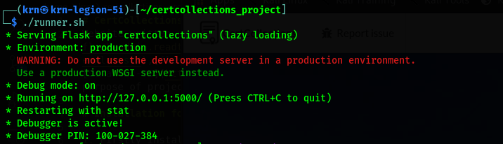

# CertCollections
Website written using [flask](https://flask.palletsprojects.com/),[flask-admin](https://flask-admin.readthedocs.io/en/latest/),[flask-login](https://flask-login.readthedocs.io/en/latest/),[flask-dropzone](https://flask-dropzone.readthedocs.io/en/latest/) and [Semantic-UI](https://semantic-ui.com/introduction/getting-started.html),based on the purpose of project submission and practice webdevelopment in these libraries of python.

# Installation for linux

1. Firstly install **python3** and **pip3** from your os specific,then clone this respository.
   
```
git clone https://github.com/Ryn0K/CertCollections.git
```

2. move to **CertCollections/**

```
cd CertCollections/
```

3.  Install project requirements libraries.
   
```
pip3 install -r requirements.txt
```

4. Now run the **runner.sh**.

```
chmod +x runner.sh 
./runner.sh
```

5. Now server should be running.



6. Navigate to [http://127.0.0.1:5000](http://127.0.0.1:5000) to get your site ready.

# Admin panel

Admin is inbuilt setup in this website.
Login with `admin@certcollections:certcollections` in user login page.
